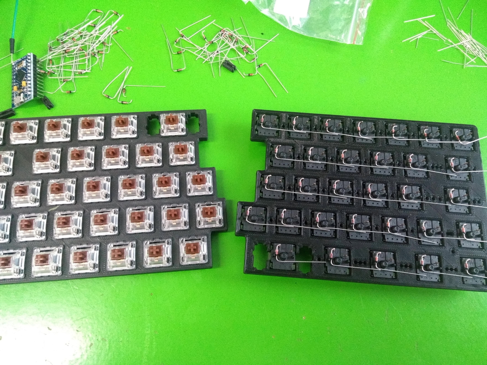
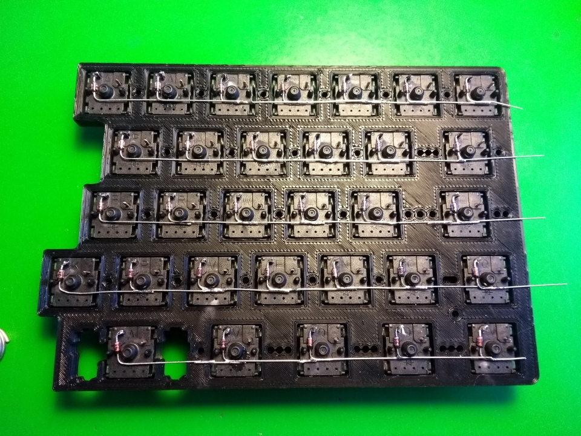
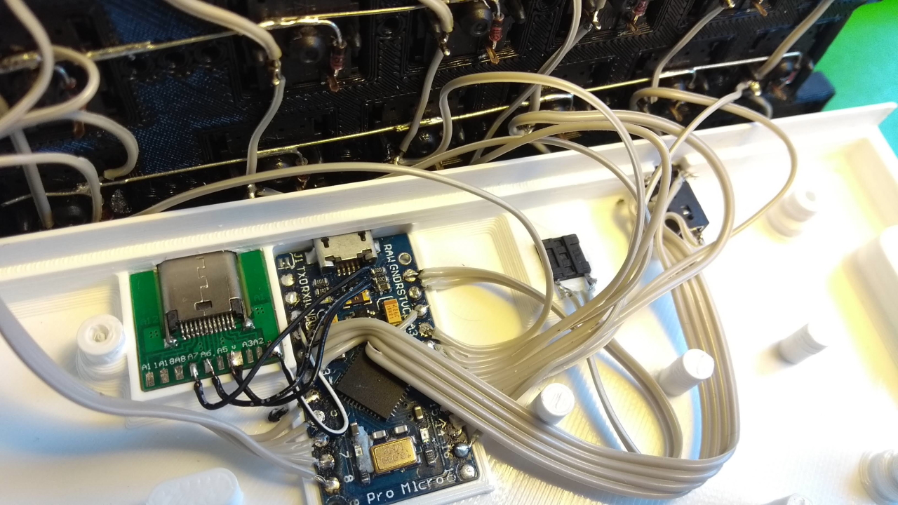

# ISOFoxSplit1008

Temporary name, I guess. This is my first try at a custom mechanichal keyboard.

Loved the Whitefox ISO layout, wanted to try splits, so.. 3d printed handwired 72 key split ISO keyboard it is!

This is a WIP and needs additional information. Keycaps obviously unrelated to function.

### Build process photos:
(sorry about the picture quality)

